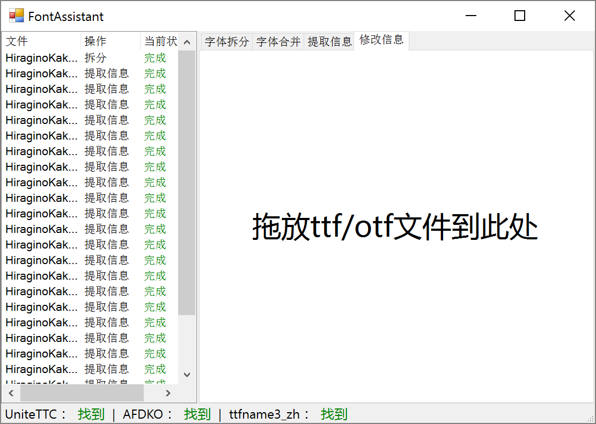

# FontAssistant
字体小助手

## 提示
这只是一个调用工具的工具而已！
通过调用[UniteTTC](http://yozvox.web.fc2.com/556E697465545443.html)、[ttfname3_zh](http://lmgtfy.com/?s=b&q=ttfname3_zh)、[AFDKO](http://www.adobe.com/cn/devnet/opentype/afdko/eula.html)来达到快速批量处理字体的目的

## 使用

使用方法可以移步我的博客 [http://iivb.net/change_ios_fonts.html](http://iivb.net/change_ios_fonts.html)